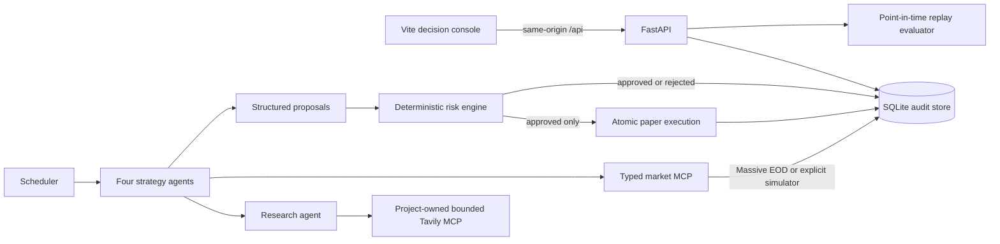

# Architecture

Agentic Trading Floor is an auditable paper-trading and decision-evaluation
system. Models can research and propose; deterministic code owns policy,
accounting, persistence, and execution. There is no broker or real-money path.

## Runtime components

- The scheduler starts supervised MCP subprocesses, runs the four traders with
  bounded concurrency, and persists cycle health, cost, prompt, model, trace,
  and decision identifiers. The standard EOD profile schedules one sequential
  post-close cycle on UTC weekdays instead of repeatedly querying unchanged
  previous-close data.
- Trader output is validated into `TradingDecision` and `TradeProposal`. Agents
  have no account-mutation tool.
- The risk engine applies configured cash, exposure, turnover, drawdown,
  universe, quantity, and market-freshness rules. Each rule result is stored.
- Paper execution checks the persisted approval and observation again, then
  commits account, transaction, observation, order, result, and log atomically.
- FastAPI exposes read models and explicitly scoped paper/replay mutations. The
  browser uses only relative `/api` routes; provider credentials remain in the
  API/scheduler environment.
- A run-progress endpoint joins the coordinated run, per-agent cycle telemetry,
  and run-correlated safe stage logs. The dashboard polls it while agents run so
  pending, active, successful, and failed stages are visible without exposing
  model prompts, responses, or private reasoning.
- The evaluator loads hashed decision fixtures separately from withheld outcome
  fixtures and uses an injected replay clock.

## Data contracts

All boundary models are strict Pydantic contracts; extra fields are rejected at
decision, research, risk, order, execution, and evaluation boundaries.

| Contract | Required provenance or control fields |
|---|---|
| `MarketObservation` | symbol, price, currency, market/retrieval timestamps, source, mode, staleness, endpoint |
| `ResearchBrief` | schema and prompt version, decision cutoff, source records, citation-linked claims, caveats |
| `TradeProposal` | stable ID, account, side, integral quantity, rationale, claim IDs, exact observation |
| `RiskDecision` | stable ID, proposal ID, outcome, evaluation time, rule-level pass/fail reasons |
| `PaperOrder` / `ExecutionResult` | stable idempotency IDs, approved terms, observation, status, execution price and time |
| `AgentRunRecord` | manual/scheduled trigger, idempotency key, requester class, reserved market timestamp, lifecycle status |
| `EvaluationReport` | dataset/model/prompt versions, git SHA, seed, configuration, timestamps, metrics, leakage result |

SQLite schema changes are numbered and transactional in
`backend/migrations.py`. Proposal-to-execution records and their evidence are
retained as one audit chain. See [EVALUATION.md](EVALUATION.md) for replay
boundaries and [SECURITY.md](SECURITY.md) for threat boundaries and recovery.

## Operating modes

| Mode | Configuration | Writes | Credentials | Intended use |
|---|---|---:|---:|---|
| Seeded demo | `APP_MODE=demo`, simulated market | HTTP writes rejected | None | Safe portfolio review |
| Standard simulated | `APP_MODE=standard`, simulated market | Paper/replay only | Model and research keys for scheduler | Development |
| Standard EOD | `APP_MODE=standard`, Massive EOD | Paper/replay only | Model, research, Massive | Deliberate previous-close operation |
| Offline evaluation | `python -m evals.runner` | Results directory only | None | Replay-system validation |

The default Compose stack is the seeded demo. The scheduler is behind the
explicit `live` profile because demo mode is read-only and rejects scheduler
startup.
